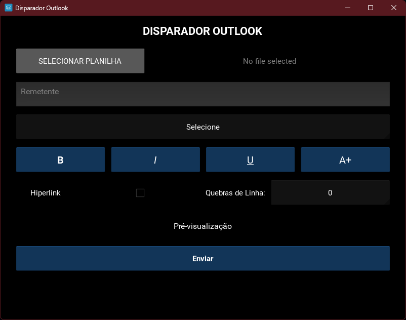

# Disparador Outlook

`EM DESENVOLVIMENTO`

Este projeto é uma aplicação Kivy para enviar emails utilizando a API do Microsoft Graph. A aplicação permite selecionar uma planilha Excel contendo os dados dos emails, formatar os corpos dos emails e enviá-los para os destinatários especificados.

## Estrutura do Projeto

```
.env
.gitignore
main.py
README.md
requirements.txt
app/
├── __init__.py
├── auth/
│   ├── __init__.py
│   └── authenticator.py
├── config/
│   ├── __init__.py
│   ├── log_settings.py
│   └── settings.py
├── controller/
│   ├── __init__.py
│   └── home_controller.py
├── enum/
│   ├── __init__.py
│   ├── email_format_type.py
│   ├── email_recipient_type.py
│   └── excel_columns.py
├── exceptions/
│   ├── __init__.py
│   ├── asyncio_exceptions.py
│   ├── authentication_exceptions.py
│   ├── configuration_exceptions.py
│   ├── email_exceptions.py
│   ├── excel_exceptions.py
│   └── main_exceptions.py
├── services/
│   ├── __init__.py
│   ├── email_formatter.py
│   ├── process_excel.py
│   └── send_email.py
└── views/
    ├── __init__.py
    ├── main.kv
    └── main_screen.py
```

## Estrutura da Planilha Excel

A planilha Excel deve seguir o exemplo estrutural abaixo, podendo ter quantos "CORPO E-MAIL" forem necessários:

| E-MAIL ASSUNTO | E-MAIL PARA (separar com ;) | E-MAIL CC (separar com ;) | E-MAIL CCO (separar com ;) | CORPO E-MAIL 1 | CORPO E-MAIL 2 | ... |
|----------------|-----------------------------|---------------------------|----------------------------|----------------|----------------|-----|
| Assunto 1      | email1@example.com;email2@example.com | cc1@example.com;cc2@example.com | cco1@example.com;cco2@example.com | Corpo do email parte 1 | Corpo do email parte 2 | ... |
| Assunto 2      | email3@example.com;email4@example.com | cc3@example.com;cc4@example.com | cco3@example.com;cco4@example.com | Corpo do email parte 1 | Corpo do email parte 2 | ... |

## Instalação

1. Clone o repositório:
    ```sh
    git clone <URL_DO_REPOSITORIO>
    cd msgraph-email-sender
    ```

2. Crie um ambiente virtual e ative-o:
    ```sh
    python -m venv venv
    source venv/bin/activate  # No Windows, use `venv\Scripts\activate`
    ```

3. Instale as dependências:
    ```sh
    pip install -r requirements.txt
    ```

4. Configure as variáveis de ambiente no arquivo `.env`:
    ```properties
    # Tenant Identification
    TENANT_ID= "your_tenant_id_here"

    # Client Credentials
    CLIENT_ID= "your_client_id_here"
    CLIENT_SECRET= "your_client_secret_here"

    # User Credentials
    USER_EMAIL= "your_email_here"

    # Log Configurations
    LOG_LEVEL="DEBUG"
    LOG_FORMAT="%(asctime)s - %(name)s - %(levelname)s - %(message)s"

    # aiohttp Configurations
    AIOHTTP_LIMIT=10

    # API Configurations
    API_SCOPE="https://graph.microsoft.com/.default"

    # Excel File Path
    EXCEL_FILE_PATH="path_to_your_excel_file_here"

    # App Configurations
    APP_TITLE="Disparador Outlook"
    APP_ICON_PATH="path_to_your_app_icon_here"

    # Email Formatting Configurations
    DEFAULT_FONT_SIZE=1
    FONT_SIZE_INCREMENT=0.50

    # Excel Processing Configurations
    INVALID_VALUES="x,nan,"

    # Email Sending Configurations
    GRAPH_API_URL="https://graph.microsoft.com/v1.0"
    SAVE_TO_SENT_ITEMS="true"
    ```

## Uso

1. Execute a aplicação:
    ```sh
    python main.py
    ```

2. Na interface da aplicação, selecione a planilha Excel contendo os dados dos emails.

3. Formate os corpos dos emails conforme necessário.

4. Clique no botão "Enviar" para enviar os emails.

## Estrutura do Código

- `main.py`: Inicializa e executa a aplicação Kivy.
- `app/auth/authenticator.py`: Lida com a aquisição e gerenciamento de tokens de acesso usando a biblioteca MSAL.
- `app/config/log_settings.py`: Configurações de logging para a aplicação.
- `app/config/settings.py`: Carrega e armazena configurações a partir de variáveis de ambiente.
- `app/controller/home_controller.py`: Lida com a lógica principal para seleção de arquivos Excel, processamento, formatação e envio de emails.
- `app/enum/email_format_type.py`: Enum para os diferentes tipos de formatação de email.
- `app/enum/email_recipient_type.py`: Enum para os diferentes tipos de destinatários de email.
- `app/enum/excel_columns.py`: Enum para as colunas no arquivo Excel usado para processamento de emails.
- `app/exceptions/asyncio_exceptions.py`: Exceções para erros no processo asyncio.
- `app/exceptions/authentication_exceptions.py`: Exceções para erros no processo de autenticação MSAL.
- `app/exceptions/configuration_exceptions.py`: Exceções para erros na configuração de variáveis de ambiente e logging.
- `app/exceptions/email_exceptions.py`: Exceções para erros no envio de emails.
- `app/exceptions/excel_exceptions.py`: Exceções para erros na leitura e escrita de arquivos Excel.
- `app/exceptions/main_exceptions.py`: Exceções para erros durante a execução principal.
- `app/services/email_formatter.py`: Formata as mensagens de email.
- `app/services/process_excel.py`: Processa arquivos Excel e extrai corpos, assuntos e destinatários de emails.
- `app/services/send_email.py`: Envia emails assincronamente usando aiohttp.
- `app/views/main.kv`: Define a interface da aplicação Kivy.
- `app/views/main_screen.py`: Lida com a interface do usuário para a aplicação de envio de emails.

## TODOs

- Arrumar a quebra de linha para corpos de email sem formatação
- Colocar toda a interface e as mensagens de resposta em português
- Separar as responsabilidades em controller, corrigir nome de métodos, e separar as funções em arquivos diferentes
- Fazer isso com a main screen também, melhorar a organização do código
- Tirar números mágicos, fazer uso de enum
- Corrigir feedbacks visuais dos botões, dos spinners e etc
- Corrigir o layout, melhorar a interface
- Adicionar novos tipos de formatação e algo mais personalizado em relação ao tamanho da fonte

## FIXME

- Corrigir o aplicativo quebrando se abrir a aba de seleção de planilha e não selecionar nada

## Preview

<div align="center">
    
</div>
